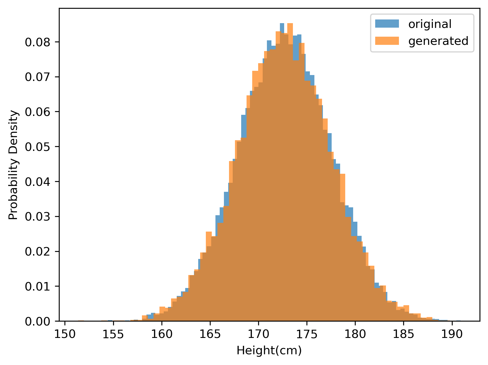

# Purpose of Generative Models

The purpose of generative models is to model the probability distribution $P(x)$ of certain data $x$ and sample new data that is similar to the samples. 
In generative models, we estimate the population using the sample. In the context of generative models, the population is a probabilistic distribution that has extracted the sample.

---

## Two Steps of Estimation

1. **Modeling**: Suppose that the population is expressible as a probability distribution which is adjustable with parameters (e.g., normal distribution).

2. **Parameter Estimation**: Estimate the parameter of the supposed (or modeled) distribution based on samples. This is done by MLE, which is **Maximum Likelihood Estimation**.

    > Example: When we suppose that the samples have been sampled from a normal distribution, then the parameters are the sample mean and sample standard deviation (through MLE).

We refer to parameter estimation as **"Training"** in generative modeling.

---

## MLE (Maximum Likelihood Estimation)

Find the optimal parameter of the modeled (or supposed) distribution that maximizes the sample likelihood.

> 샘플이 관찰될 확률(likelihood)이 가장 높은 분포를 만드는 parameters를 찾는다

The induction of MLE in the normal distribution is in book p66-69.

---

### Example
Example of MLE for a normal distribution using height data is available in [`mle.py`](./mle.py).

## Comparison between Sample and Generated Data
