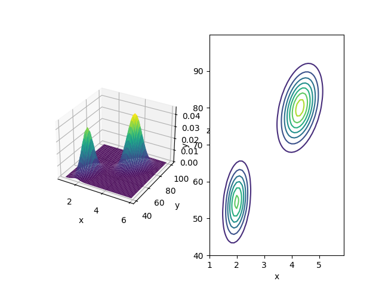
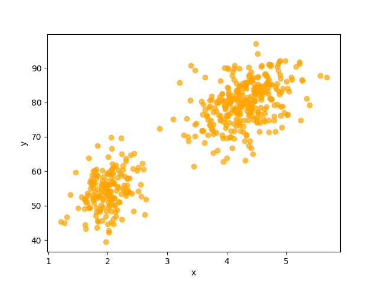

# Topic
Dealt..
- GMM(Gaussian Mixture Model) and Parameter Estimation for GMM
- Basic Probability Concept for GMM probability density p(x) induction -> Joint Probability, Conditional Probability, Marginalization

## GMM and Sampling Visualization

