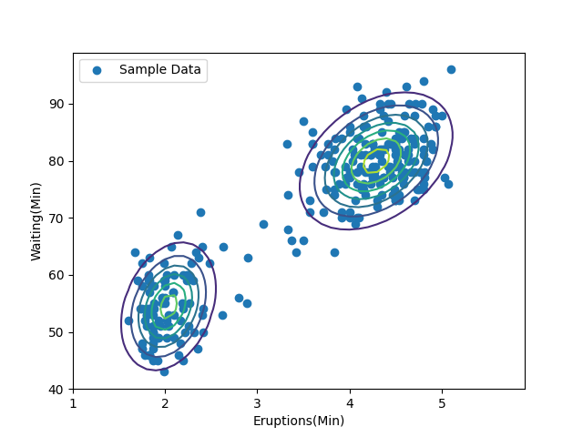
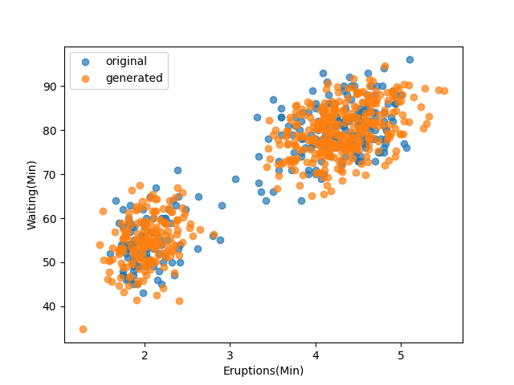

# Day 3: Learning the EM Algorithm

Day 3 covers the **Expectation-Maximization (EM) algorithm**.

- Begins with the derivation of the **ELBO (Evidence Lower Bound)** formulation for probabilistic models with latent variables $z$.
- Followed by a detailed walkthrough of the **EM algorithm applied to Gaussian Mixture Models (GMM)**.
- Includes a **coding exercise** to implement the algorithm in practice.

> This directory summarizes both theoretical and practical aspects of the EM algorithm covered on Day 3. Check out the [code](./em.py) and [note](./day3%20note.pdf) for a deeper understanding.

# EM result & Generated Data and Original Data Comparison
**EM result**

-> Contour line of GMM model after EM algorithm training

**Generated Data vs Original Data Comparison**

-> Sampled 500 datas from trained GMM model