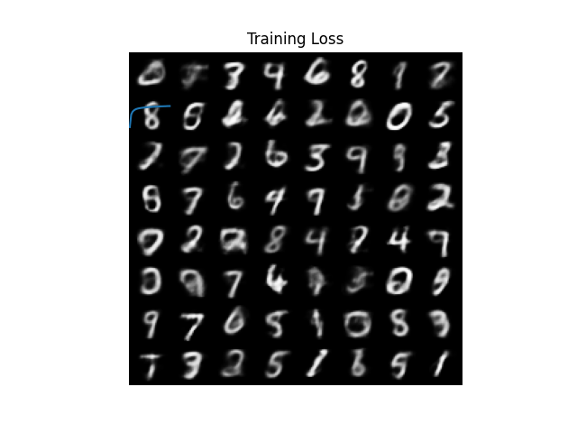

## Day 4: Variational Autoencoder (VAE)

On Day 4, we focused on the theoretical foundation of Variational Autoencoders (VAE), particularly the derivation of the Evidence Lower Bound (ELBO) and the training procedure that maximizes the ELBO. We also conducted a practical coding session using the MNIST dataset to train a VAE.

---

### 📒 Notes and Resources

- **📘 Theoretical Notes (Day 4 Note)**  
  

- **📝 VAE Summary Note**  
  

- **🖼️ Generated Samples trained with VAE (Images)**  
  

---

### 📌 Practical Session Overview
- Dataset: **MNIST**
- Implementation details:
  - Defined encoder and decoder architectures
  - Computed ELBO-based loss (Reconstruction Loss + KL Divergence)
  - Sampled from the latent space to reconstruct and generate images

---

VAE serves as a foundational model for understanding generative modeling and provides a basis for exploring advanced variants such as β-VAE and Conditional VAE. The content covered on Day 4 strengthened our understanding of probabilistic encoding/decoding and graphical modeling.