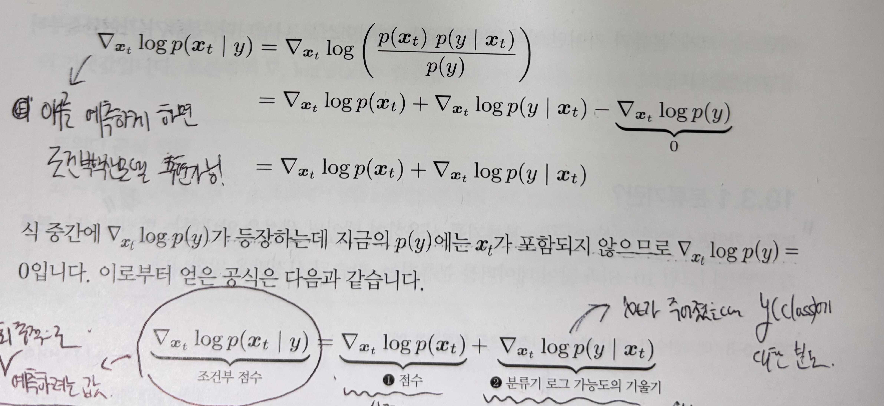
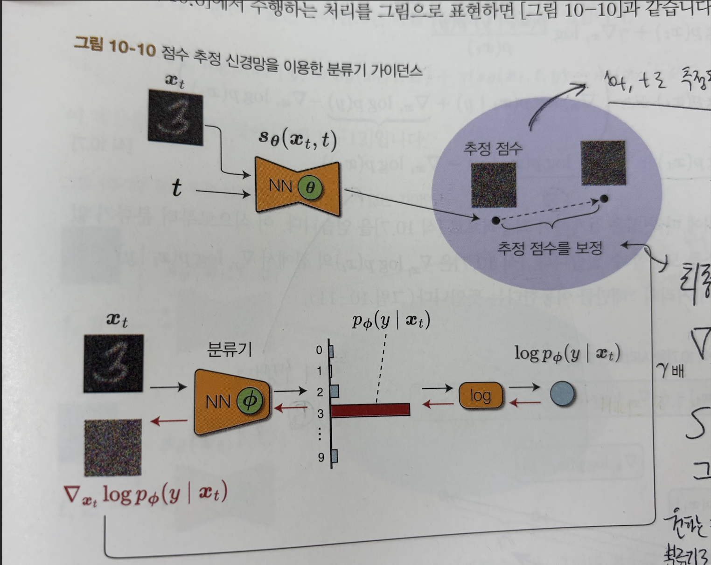
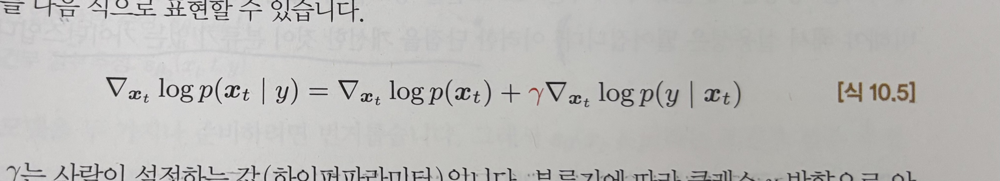

# Classifier Guidance Diffusion Model

For Diffusion Neural Network that predicts **score function...**

## Training 과정 설명

1. **Denoising NN** : 원래 naive한 diffusion model처럼 Diffusion안의 Neural Network가 xt, t를 입력으로 받아 x0 → xt로 forward diffusion process 시에 추가된 gaussian noise 위에 상수배를 곱한 score를 예측하는 방식으로 학습을 진행한다 ➜ 이때 Denoising NN은 "무조건부" 점수를 예측하는 방식으로 훈련됨.

2. **Classifier** : 추가적으로 noise가 낀 이미지에 대해 Classifier가 올바르게 label을 분류할 수 있도록 훈련됨. 별도로 Training 되며, 서로의 Loss에 관여하지 않음.

궁금한 것

아니.. denoising network가 무조건적으로 학습이 되는데(이렇게 학습을 진행하면 후에 샘플링할때 무작위로 클래스 생성이 되는데??) 어떻게 후에 샘플링 할 시에 원하는 방향(조건)으로 샘플을 유도 할 수 있나?

➜ 샘플링 과정에서 노이즈 이미지를 분류하도록 훈련된 Classifier의 Gradient를 이용하여 원하는 조건 방향으로 유도할 수 있다! 이 gradient를 **조건부 생성방향**이라고 표현

## Sampling, Generating 과정 설명

우선 우리가 생성하고자 하는 label condition을 부여한다.

A. Complete한 Gaussian Noise 샘플 xt부터 시작하여, Denoising NN은 (xt, t)를 입력으로 받아서 각 지점에서의 score를 예측한다.

B. 여기에 대해 classifier에 xt를 통과시켜 우리가 원하고자 하는 condition y에 대한 확률을 계산하고 여기에 log를 취한다. 이에 대해 입력 xt에 대한 gradient를 구하면 분류기 로그 가능도의 기울기를 알아낼 수 있다.

위의 그림과 같이 B항에 A항을 더하여서 샘플링 시에 우리가 원하고자 하는 조건 방향으로 원래의 1) 점수를 보정하는 효과를 얻는다.

(r은 B항의 기여도를 결정한다. 어느 정도의 강도로 조건 y를 반영하도록 할 것인지를 결정하는 하이퍼 파라미터이다. = 보정하는 강도

그러나 Classifier Guidance 방식은 분류기를 따로 준비해야 하고 training cost가 추가된다는 단점이 있음. 이를 개선하기 위해 CFG(Classifier Free Guidance)라는 방법이 최근에는 이용된다고 함.

## Summary

➜ (점수를 예측하는 확산 모델에서) Classifier Guidance Diffusion Model은 일반적인 점수 추정(무조건 점수) Diffusion Model에 Classifier를 결합시켜 조건부 점수를 도출하는 형식으로 구현된다. 

➜ 이 모델에서 Guidance는 조건 없는 score 예측을 학습된 classifier에서 생긱는 gradient를 통해 보정함으로써 구현된다. 이때 hyperparameter r은 생성 시에 얼만큼의 강도로 조건 방향으로 보정할 지에 대한 강도를 나타내는 것
